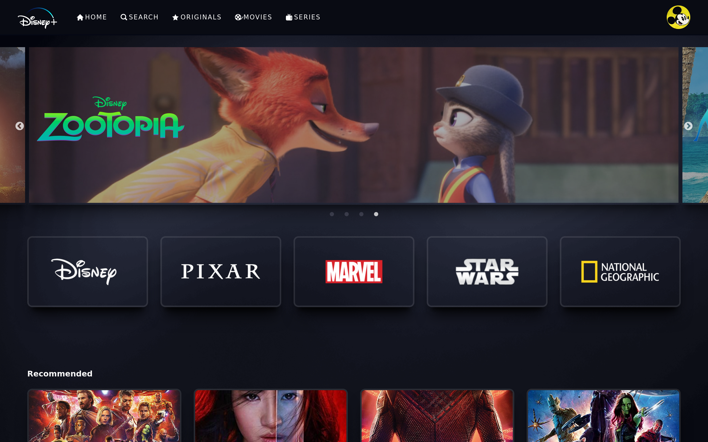

# Disney Clone

This project is a simple movie directory that emulates the UI of Disney+ streaming webpapp, for doing this practice web app, I use React and firebase to host the content.

## Table of contents

- [Overview](#overview)
  - [Screenshots](#screenshot)
  - [Link to live site](#links)
- [My process](#my-process)
  - [Built with](#built-with)
  - [What I learned](#what-i-learned)
  - [Continued development](#continued-development)
  - [Useful resources](#useful-resources)
- [Author](#author)

## Overview

In this project I make use of React, as well as styled component library for making all the UI styles. I also put in practice the use of Redux Toolkit, for managing the state.

### Screenshots

- Login Page:

  

- Home Page:

  

- Detail Page:

  

- Search Page:

  

### Links

- Live Site URL: [Live Site](https://jaime9611.github.io/fylo-landing-page/)

## My process

In building this project, I used Webpack to bundle all my files and to compress the images, so that the final "dist" folder will be ready for production. I also configure Webpack to compile the .scss files used for styling the page.

### Built with

- Semantic HTML5 markup
- Mobile-first workflow
- SASS
- Flexbox
- Webpack

### What I learned

Simple styling with Sass, using mixins and functions to best follow the "DRY" principle, Flexbox for layout and the use of Webpack for bundling and compilation.

### Continued development

Continue learning Sass and learn more about Webpack configuration.

### Useful resources

- [MDN](https://developer.mozilla.org/es/docs/Learn) - This helped me for reviewing CSS properties and Javascript coding.
- [W3Schools](https://www.w3schools.com/css/) - This is an useful resource for css properties and simple use cases.

## Author

- Github - [Jaime9611](https://github.com/Jaime9611)
- Frontend Mentor - [@Jaime9611](https://www.frontendmentor.io/profile/Jaime9611)
